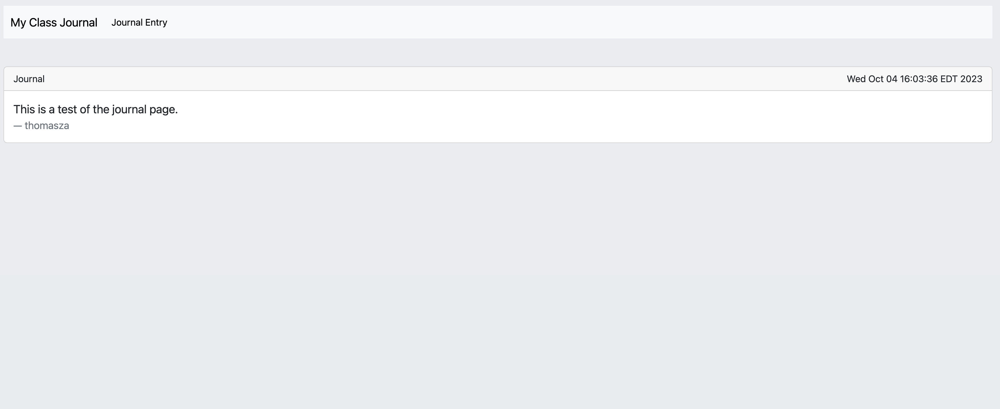
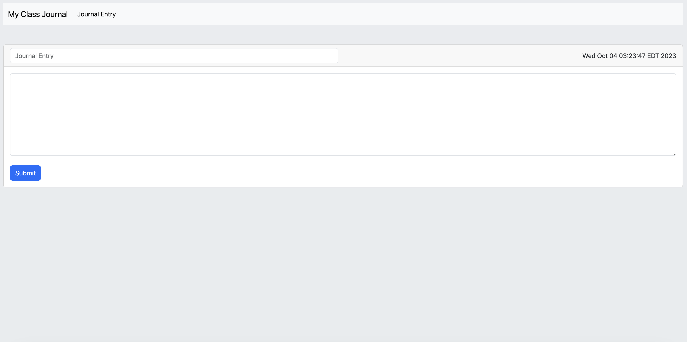

# My Class Journal - thomasza

Currently utilizing:

* Spring Boot
* Thymeleaf w/ Thymeleaf Layout Dialect
* Bootstrap
* Lombok
* JUnit
* H2 Database
* Spring Data JPA

Wanted to actually implement everything so you could actually post journals successfully to the H2 database but couldn't figure out how to do it without breaking the current unit tests. Will maybe try later after assignment is graded.

## Screenshots

## Gradesheet

#### Did something extra - 10/10

**What, specifically, did you do extra?**

Added Thymeleaf w/ Thymeleaf Layout Dialect and Bootstrap for Frontend. Added and setup H2 database and created data.sql to seed database. Included Spring Data JPA.

#### IntelliJ installed and working - 10/10

#### The project builds without error - 10/10

#### Unit tests pass - 10/10

#### Service classes implement the provided interface - 10/10

#### DTOs are created properly, and use Lombok annotations - 10/10

#### All work is committed and pushed to github repo - 10/10

#### CircleCI is configured properly - 10/10

#### Code is in good form - 10/10

CircleCI URL: https://app.circleci.com/pipelines/github/uc-soit/individual-assignment-1-my-class-journal-thomasza

Latest Workflow: https://github.com/uc-soit/individual-assignment-1-my-class-journal-thomasza/actions/runs/6402831109/job/17380149457
